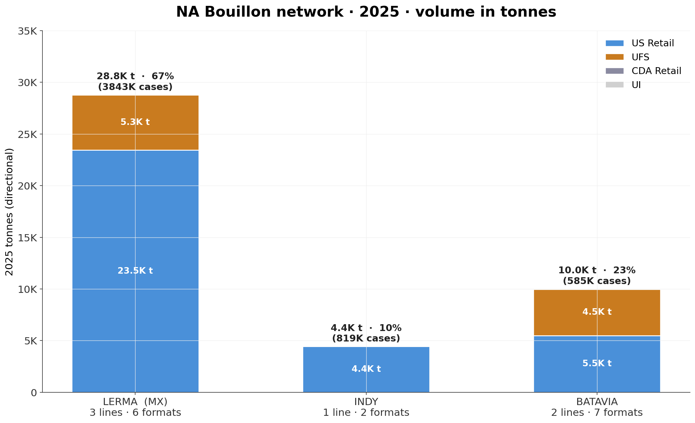
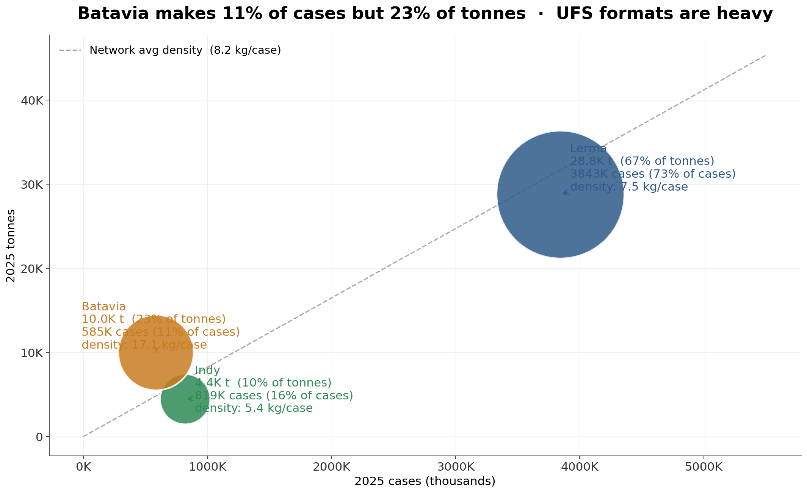
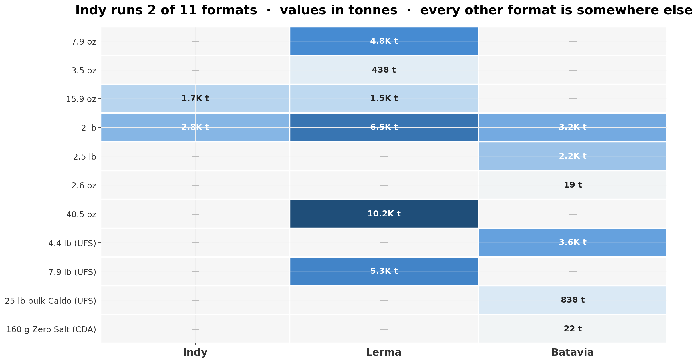
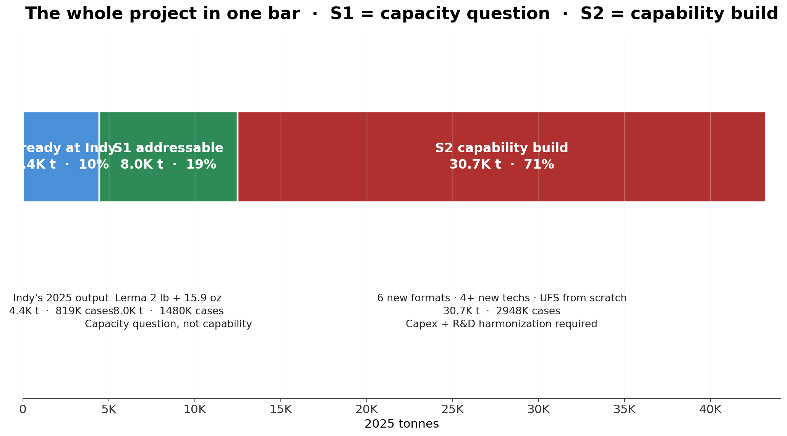
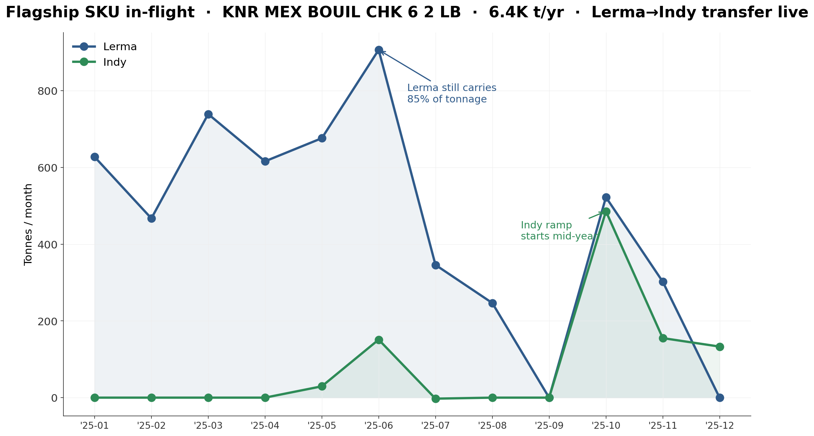

<!-- _class: lead -->
<!-- _paginate: false -->
<!-- _footer: "" -->

North America Foods · Transformation

# NA Bouillon — Current-State Pack

## Network & Business Baseline · Week 1

 

**Prepared for:** Wez Beauplan · Associate Director, Foods Transformation (NA)
**Scope:** Current-state network (Scope A) + business baseline (Scope B)
**Source:** `Copy of RT and UFS Bouillon 4.13.26.xlsx` · 57 SKUs · 5.25M cases · 43,235 t · 2025 FY
**Date:** 2026-04-15

---

# Executive summary

The real project question is not <b>"should we consolidate at Indy."</b> The Lerma → Indy shift is already in motion for the formats Indy can run today. The question is where the line sits between <b>formats Indy can absorb with headroom (8,044 t / 1.48M cases)</b> and <b>formats Indy would have to build new capability for (30,746 t / 2.94M cases)</b>. Those two scenarios have fundamentally different cost, capex and risk profiles — and framing them that way is how leadership gets a decision it can act on.

### The five facts that carry the pack

1. **43,235 t · 5.25M cases across 3 sites.** Tonnes: Lerma 67% (28,783 t) · Batavia 23% (10,007 t) · Indy 10% (4,445 t). Cases: Lerma 73% · Indy 16% · Batavia 11%. **Batavia = 11% cases but 23% tonnes** — UFS formats are heavy.
2. **44% of network cases are in multi-site SKUs.** 100% of Indy's volume is shared with Lerma. **Batavia has zero overlap with anyone.** Lerma is 38.5% shared / 61.5% unique.
3. **The Lerma → Indy shift is already executing.** 6 SKUs mid-handoff in 2025 — but the flagship (7,600 t/yr) is **only 15% migrated**.
4. **Indy today is a single-line, two-format, Retail-only factory.** Line 15 · 2 lb + 15.9 oz · 100% Retail · **zero UFS** · 4,445 t total.
5. **Scenario 2 is a capability build, not a volume transfer.** 30,746 t sit in formats or technologies Indy has never run.

---

# The one chart — volume in tonnes

Case share (73/16/11) is not tonnage share (67/10/23). <b>Batavia carries 23% of tonnes on 11% of cases</b> — its UFS formats average 17 kg/case vs Indy's 5.4 kg/case. Lerma is the scale site. Indy is a Lerma-mirror in execution. Batavia is a technology monopoly.

---

# Batavia punches 2× its case weight in tonnes

Batavia's 4.4 lb and 25 lb UFS formats average <b>17 kg/case</b> vs Indy's 5.4 kg/case. Any consolidation plan that uses cases as the primary unit will understate the Batavia capability build by ~2×. <b>Tonnes is the right unit for production planning.</b>

---

# Format × site complexity — the capability gap

Indy runs <b>2 of 11</b> formats in the network. Every other format — 7.9 oz (~4,800 t), 4.4 lb Caldo UFS (~3,600 t), 7.9 lb UFS (~5,300 t), 3.5 oz, 25 lb Caldo, MixMod, Natural — runs somewhere Indy does not. Scenario 2 is therefore a capability build, not a line transfer.

---

# The whole project in one bar

### Scenario 1 — Maximize Indy

**8,044 t · 1.48M cases**
Capacity / throughput question. Line-15 headroom + second-line decision. Low–medium capex. R&D dependency: low. Near-term.

### Scenario 2 — Full Consolidation

**30,746 t · 2.94M cases**
Capability-build + harmonization program. 6 new formats · 4+ new technologies · UFS footprint from scratch. High capex. **R&D harmonization is the critical path.** 3-year horizon.

S1 and S2 are <b>different kinds of projects</b>, not "low case / high case" of the same plan. They should not share a single set of assumptions.

---

# The Lerma → Indy shift is already running

The <b>biggest single SKU in the network</b> (1.18M cases/yr) is the <b>least migrated</b>. Easy wins are nearly done (top SKU 96% moved); the bulk of Scenario 1's upside sits in one barely-started SKU. Week 2 separates "already booked" from "net new."

---

# Indy — advantaged and constrained _(unhedged read)_

<h3 class="good">Advantaged</h3>

- **Domestic US logistics.** 818K cases served without crossing a border vs Lerma's 3.47M cross-border flow.
- **Already running the 2 biggest Retail formats.** 2 lb + 15.9 oz = 44% of network Retail demand.
- **Proven transfer execution.** Six Lerma ↔ Indy SKUs mid-handoff in 2025; one at 96%.
- **Clean single channel.** 100% US Retail. No split-channel, no UFS overhead, no CDA regulatory scope.

<h3 class="bad">Constrained</h3>

- **Single line.** One physical line ("15") carries 100% of Indy's output — no internal redundancy.
- **Two formats only.** 2 lb + 15.9 oz. Everything else = new pack capability.
- **Zero UFS.** Not a ramp issue — **never run UFS**. The 901K-case NA UFS network cannot move here without a build.
- **100% Lerma product dependence.** Zero unique SKUs · zero independent R&D footprint.
- **Scale is small.** 16% of cases · 10% of tonnes.

Indy is a <b>strong foundation for Scenario 1</b> if line-15 headroom exists. It is a <b>weak foundation for Scenario 2</b> — not a harder version of S1, a different kind of project.

---

# What Week 2 will answer

<b>Q1.</b> How much of the 1.48M Lerma-addressable pool can Indy absorb without new line investment — and what does the second-line decision look like if the answer is "not much more"?  
<b>Q2.</b> For the 2.94M cases Indy cannot run today, which subset is worth building capability for at Indy, on what 3-year glidepath, with what harmonization dependency?

|                    | **Scenario 1 — Maximize Indy**          | **Scenario 2 — Full Consolidation**                           |
| ------------------ | --------------------------------------- | ------------------------------------------------------------- |
| **Shape**          | Capacity / throughput question          | Capability-build + harmonization program                      |
| **Scope**          | 1.48M cases · 2 lb + 15.9 oz            | 2.94M cases · 6 new formats · 4+ new techs · UFS from scratch |
| **Gate**           | Line-15 headroom + second-line decision | R&D harmonization roadmap + capex envelope                    |
| **Capex**          | Low–medium                              | High                                                          |
| **R&D dependency** | Low                                     | **High — critical path**                                      |
| **Horizon**        | Near-term                               | 3-year glidepath                                              |

**Week 2 deliverables:** 3-year glidepath per scenario · comparative matrix · draft recommendation framing (recommendation itself lands Week 3).

---

# What Week 2 needs from you _(data asks)_

### P0 — blocks scenario quantification

- **D1** Site-level conversion cost × sub-category
- **D2** Directional gross margin × site × channel
- **D3** Indy line 15 capacity + 2025 utilization
- **D7** R&D harmonization roadmap status per SKU family
- **D8** Formal status of Lerma → Indy in-flight transfers _(tracked program vs tactical)_

### P1 — Week-2 gates

- **D4** Lerma Mateer 1 / 2 / 3 capacity
- **D5** Batavia line 13 + line 0 capacity
- **D6** Named co-manufacturers / overflow / resiliency partners
- **D9** RM sourcing points by site
- **D10** US-MX cross-border logistics benchmark
- **D11** Existing Indy capex / shift-expansion study

<b>Single highest-leverage question:</b> D8 — is the 2025 Lerma → Indy shift a tracked program or tactical? The answer reframes both the Scope B baseline and the Scenario 1 addressable pool.

---

# Appendix — data quality & reconciliation

### Source

- `Copy of RT and UFS Bouillon 4.13.26.xlsx` · single sheet · header row 3 · 57 SKU rows · monthly columns decoded from Excel date serials
- Grand total reconciles: **5,246,057 cases** (monthly sum = `Total 25` column)

### Site × channel reconciliation _(used throughout)_

**Cases:**

| Site      |     US Retail |         UFS | CDA Retail |        UI |     **Total** |
| --------- | ------------: | ----------: | ---------: | --------: | ------------: |
| Lerma     |     3,469,125 |     371,526 |          — |     2,113 | **3,842,764** |
| Indy      |       818,078 |           — |          — |       459 |   **818,537** |
| Batavia   |        42,899 |     530,312 |     11,545 |         — |   **584,756** |
| **Total** | **4,330,103** | **901,837** | **11,545** | **2,572** | **5,246,057** |

**Tonnes (directional, Cases × Tonnes/CS):**

| Site      | US Retail | UFS | CDA Retail | UI | **Total** |
| --------- | --------: | --: | ---------: | -: | --------: |
| Lerma     | 23,451 t | 5,325 t | — | 7 t | **28,783 t** |
| Indy      | 4,443 t | — | — | 2 t | **4,445 t** |
| Batavia   | 5,501 t | 4,484 t | 22 t | — | **10,007 t** |
| **Total** | **33,395 t** | **9,809 t** | **22 t** | **9 t** | **43,235 t** |

### What the workbook does **not** contain _(named, not hidden)_

Unit conversion cost · gross margin · line capacity / utilization · named co-mans · R&D harmonization status · cross-border logistics cost.
→ Tracked as D1–D12 open data requests. Week 1 ships with the gaps named. Week 2 cannot start scenario quantification without D1 / D2 / D3 / D7 / D8.

### Supporting artifacts

`analysis/network_map.md` · `analysis/format_line_complexity.md` · `analysis/baseline_by_site.md` · `analysis/week2_preview.md` · `logs/data_quality_memo.md` · `logs/assumptions.md` · `logs/open_questions.md` · `logs/open_data_requests.md`
